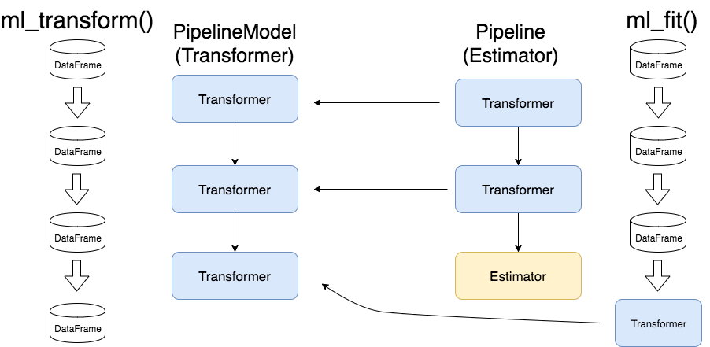

<b>Datasets necessários:</b>

- Credit Data

<b>O que é um Pipeline?<br></b>
Como diz a própria documentação do Scikit-Learn, o pipeline é uma sequência de transformações seguidas de um estimador final. O objetivo é reunir diversas etapas para serem validadas em conjunto ao definir parâmetros diferentes.

Dentre as principais vantagens do pipeline, estão:

- Dar maior legibilidade ao código;
- Facilitar a leitura do código;
- Forçar a execução das transformações na ordem correta;
- Tornar o script mais reproduzível.
- Sendo assim, ao invés de você executar todas as transformações de forma desorganizada ao longo do código, com as funções de pipeline você terá tudo organizado em um pequeno trecho do seu programa.

<b>Estrutura do Pipeline:</b>


<b>Sintaxes possíveis:</b>

1 - PIPELINE

```python
pipe = Pipeline([('transformacao_1', transformacao_1()),
                 ('transformacao_2', transformacao_2()),
                 ...
                 ('transformacao_n', transformacao_n()),
                 ('modelo', modelo())])

pipe.fit(X_train, y_train)
pipe.score(X_test, y_test)
```

2 - MAKE_PIPELINE

```python
pipe2 = make_pipeline(transformacao_1(), transformacao_2(),
 ... , transformacao_n(),  modelo())
pipe2.fit(X_train, y_train)
pipe2.score(X_test, y_test)
```

3 - PIPELINE + COLUMN_TRANSFORMER
3.1

```python
t = [('num', SimpleImputer(strategy="median"), colunas_numericas),
('cat', SimpleImputer(strategy="most_frequent"), colunas_categoricas)]
transformer = ColumnTransformer(transformers=t)
```

```python
numeric_transformer = Pipeline(
steps=[("median_imputer", SimpleImputer(strategy="median")), ("scaler", StandardScaler())]
)

categorical_transformer = Pipeline(
steps=[('freq_imputer', SimpleImputer(strategy='most_frequent')]
)

# aplica transformador numerico nas colunas 0 e 1 e categorico nas 2 e 3
t = [('num', numeric_transformer, [0, 1]), ('cat', categorical_transformer, [2, 3])]
transformer = ColumnTransformer(transformers=t)
```
